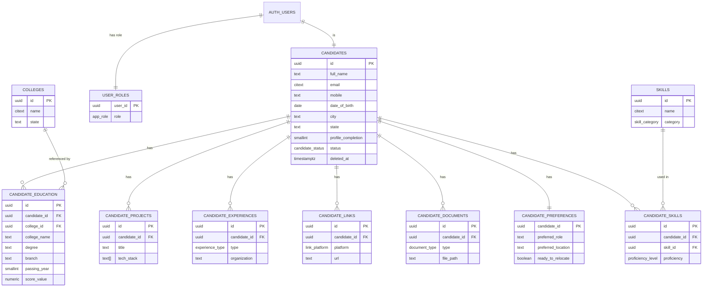

# Phase 3 — Database Schema Design

**Project:** Magnus Copo Candidate Registration Portal (MCRP)
**Database:** Supabase PostgreSQL (single source of truth)
**Status:** Phase 3 of 6 — Schema, relationships, indexes, ER diagram
**Last updated:** 2026-06-27

---

## 1. Design principles

1. **Normalized, not flat.** Your current pain is duplication and inconsistency from
   one-row-per-candidate spreadsheets. We split repeating data (skills, projects,
   experience, links, education) into their own tables linked by `candidate_id`. One
   fact lives in exactly one place.
2. **Master/reference tables for the values that get typed inconsistently** (skills,
   colleges) — so "React"/"react"/"ReactJS" don't become three different things. This
   directly fixes your inconsistency problem and makes search reliable.
3. **Built on Supabase Auth.** Login identities live in Supabase's managed `auth.users`
   table (it hashes passwords, handles OTP). Our `candidates` table holds the *profile*
   and links 1:1 to the auth user. We never store raw passwords.
4. **Row Level Security (RLS) from day one.** A candidate can only ever read/edit their
   own data; admins can see all. Enforced at the database, not just the app.
5. **Soft delete, not hard delete.** "Disable/Delete" sets a flag/timestamp so data is
   recoverable and audit-safe; true deletion is a deliberate admin action.
6. **Designed for clean search/filter today** (your listed filters) **and growth later**
   (multi-degree, mobile-OTP, more document types) **without a rewrite.**

### Naming conventions
- `snake_case` for tables and columns; **plural** table names (`candidates`, `skills`).
- Primary key is always `id` (UUID). Foreign keys are `<entity>_id` (`candidate_id`).
- Every table has `created_at timestamptz default now()`; mutable tables also
  `updated_at timestamptz` (auto-updated by trigger).
- Booleans read as questions: `is_primary`, `ready_to_relocate`, `is_current`.
- Timestamps are `timestamptz` (UTC); dates that have no time are `date`.

---

## 2. Enumerated types (fixed small value sets)

Using enums keeps these consistent and self-documenting:

| Enum | Values |
|---|---|
| `gender_type` | `male`, `female`, `other`, `prefer_not_to_say` |
| `skill_category` | `programming_language`, `framework`, `database`, `tool`, `cloud_platform`, `soft_skill`, `other` |
| `proficiency_level` | `beginner`, `intermediate`, `advanced`, `expert` |
| `experience_type` | `internship`, `freelance`, `work`, `startup` |
| `link_platform` | `github`, `linkedin`, `portfolio`, `hackerrank`, `leetcode`, `codechef`, `kaggle`, `other` |
| `document_type` | `resume`, `other` *(resume only in MVP; room to grow)* |
| `score_type` | `cgpa`, `percentage` |
| `candidate_status` | `active`, `disabled` |
| `registration_status` | `registered`, `email_verified`, `profile_started`, `resume_uploaded`, `profile_completed` |
| `app_role` | `candidate`, `admin`, `super_admin` |

---

## 3. Tables

### 3.1 `candidates` — the candidate profile (1:1 with `auth.users`)
| Column | Type | Notes |
|---|---|---|
| `id` | uuid PK | **= `auth.users.id`** (FK). Ties profile to login identity. |
| `candidate_code` | text, unique, not null | Human-friendly ID **MCR-26-06-0001** format, auto-generated (see §3.13). |
| `full_name` | text, not null | |
| `email` | citext, **unique**, not null | Mirror of auth email. **Dedup key #1.** |
| `mobile` | text, **unique**, not null | India format; validated in app. **Dedup key #2.** |
| `whatsapp` | text | Optional; "same as mobile" checkbox in UI. |
| `date_of_birth` | date | |
| `gender` | `gender_type` | |
| `address` | text | |
| `city` | text | Indexed (filter). |
| `state` | text | Indexed (filter). |
| `pin_code` | text | |
| `status` | `candidate_status` | default `active`. Drives admin Disable. |
| `registration_status` | `registration_status` | Lifecycle stage; default `registered` (see §8.1). |
| `profile_completion` | smallint | 0–100, kept current by trigger (see §8). |
| `email_verified` | boolean | default false; mirrors Supabase Auth verification. |
| `mobile_verified` | boolean | default false; flips true when SMS OTP is added later. |
| `registration_source` | text | e.g. campaign/college — *optional*. |
| `consent_accepted_at` | timestamptz | DPDP consent capture. |
| `consent_version` | text | Which privacy-policy version was accepted. |
| `created_at` | timestamptz | |
| `updated_at` | timestamptz | |
| `deleted_at` | timestamptz, null | Soft delete (admin "Delete"). |

> **Duplicate detection:** the `unique` constraints on **`email`** and **`mobile`** make
> duplicates impossible at the database level. The registration form additionally checks
> both *before* submit and shows a friendly "an account with this email/mobile already
> exists — login or reset password instead" message, so users never hit a raw DB error.

### 3.2 `candidate_education` — 1 candidate → many education records
Modeled one-to-many so a candidate can have UG + PG later (form collects one in MVP).
| Column | Type | Notes |
|---|---|---|
| `id` | uuid PK | |
| `candidate_id` | uuid FK → candidates | on delete cascade |
| `college_id` | uuid FK → colleges, null | Canonical college if matched. |
| `college_name` | text | Typed value / fallback (kept for search even if no match). |
| `university` | text | |
| `degree` | text | e.g. B.E, B.Tech, BCA, MCA. |
| `branch` | text | e.g. CSE, ISE, ECE. Indexed (filter). |
| `specialization` | text | e.g. AI/ML, Data Science. |
| `current_semester` | smallint | |
| `passing_year` | smallint | Indexed (filter). |
| `score_type` | `score_type` | cgpa or percentage. |
| `score_value` | numeric(5,2) | 0–10 (cgpa) or 0–100 (percentage). |
| `backlogs` | smallint | default 0. |
| `is_primary` | boolean | default true; the main qualification. |
| `created_at` / `updated_at` | timestamptz | |

### 3.3 `skills` — master skill list
| Column | Type | Notes |
|---|---|---|
| `id` | uuid PK | |
| `name` | citext, unique | "React" stored once, ever. |
| `category` | `skill_category` | language/framework/db/tool/cloud/soft/other. |
| `created_at` | timestamptz | |

### 3.4 `candidate_skills` — candidate ↔ skill (many-to-many)
| Column | Type | Notes |
|---|---|---|
| `id` | uuid PK | |
| `candidate_id` | uuid FK → candidates | cascade |
| `skill_id` | uuid FK → skills | |
| `proficiency` | `proficiency_level`, null | Self-declared; optional. |
| `years_experience` | numeric(3,1), null | |
| | | **unique(`candidate_id`,`skill_id`)** — no dup skills. |

### 3.5 `candidate_projects` — 1 → many
| Column | Type | Notes |
|---|---|---|
| `id` | uuid PK | |
| `candidate_id` | uuid FK | cascade |
| `title` | text, not null | |
| `description` | text | |
| `tech_stack` | text[] | array of technologies. |
| `project_url` | text | live link. |
| `repo_url` | text | source link. |
| `start_date` / `end_date` | date, null | |
| `created_at` / `updated_at` | timestamptz | |

### 3.6 `candidate_experiences` — 1 → many (internship/freelance/work/startup)
| Column | Type | Notes |
|---|---|---|
| `id` | uuid PK | |
| `candidate_id` | uuid FK | cascade |
| `type` | `experience_type` | |
| `organization` | text, not null | |
| `title` | text | role/designation. |
| `description` | text | |
| `location` | text | |
| `start_date` / `end_date` | date, null | |
| `is_current` | boolean | default false. |
| `created_at` / `updated_at` | timestamptz | |

### 3.7 `candidate_links` — 1 → many professional profiles
| Column | Type | Notes |
|---|---|---|
| `id` | uuid PK | |
| `candidate_id` | uuid FK | cascade |
| `platform` | `link_platform` | github/linkedin/leetcode/… |
| `url` | text, not null | |
| `label` | text | used when `platform = other`. |
| | | unique(`candidate_id`,`platform`) for known platforms. |

### 3.8 `candidate_preferences` — 1:1 career preferences
| Column | Type | Notes |
|---|---|---|
| `candidate_id` | uuid PK FK → candidates | cascade |
| `preferred_role` | text | |
| `preferred_location` | text | |
| `ready_to_relocate` | boolean | |
| `expected_ctc` | numeric(12,2), null | annual, INR. |
| `immediate_joining` | boolean | |
| `notice_period_days` | smallint, null | shown if not immediate. |
| `created_at` / `updated_at` | timestamptz | |

### 3.9 `candidate_documents` — 1 → many (resume in MVP)
File bytes live in **Supabase Storage**; the DB stores only the path/URL.
| Column | Type | Notes |
|---|---|---|
| `id` | uuid PK | |
| `candidate_id` | uuid FK | cascade |
| `type` | `document_type` | `resume` in MVP. |
| `file_path` | text, not null | Storage object path. |
| `file_name` | text | original name. |
| `mime_type` | text | enforce `application/pdf` in app. |
| `size_bytes` | integer | enforce max size in app. |
| `uploaded_at` | timestamptz | |
| | | partial unique: one active `resume` per candidate. |

### 3.10 `colleges` — master/reference (searchable, admin-mergeable)
| Column | Type | Notes |
|---|---|---|
| `id` | uuid PK | |
| `name` | citext, unique | |
| `city` / `state` | text | |
| `is_approved` | boolean | default false for student-added entries; admin approves. |
| `merged_into_id` | uuid FK → colleges, null | set when this college is merged into a canonical one. |
| `created_at` | timestamptz | |
> **Search + add-if-missing:** registration shows a typeahead/search over this list. If
> the student's college isn't found, they add it — it's saved with `is_approved = false`
> and still usable immediately (also kept as `college_name` text on the education row).
> **Admin merge:** an admin can later mark a duplicate college as merged
> (`merged_into_id` → canonical id) and re-point affected education rows, collapsing
> "VTU"/"Visvesvaraya Technological University" into one. Lightweight, no data loss.

### 3.11 `user_roles` — RBAC (who is admin)
| Column | Type | Notes |
|---|---|---|
| `user_id` | uuid PK FK → auth.users | |
| `role` | `app_role` | default `candidate`. |
| `created_at` | timestamptz | |
> Candidates don't need a row (default role). Admins/super-admins get a row. RLS
> policies check this table.

### 3.12 `audit_logs` — admin action trail *(recommended — see §8, please approve)*
| Column | Type | Notes |
|---|---|---|
| `id` | bigint identity PK | |
| `actor_id` | uuid | which admin. |
| `action` | text | `update` / `disable` / `delete` / `export`. |
| `entity` | text | e.g. `candidate`. |
| `entity_id` | uuid | affected record. |
| `changes` | jsonb | before/after snapshot. |
| `created_at` | timestamptz | |

### 3.13 Candidate ID generation (`MCR-26-06-0001`)
The public code encodes **company + year + month + a per-month running number**, so it's
both human-readable and sortable:

```
 MCR  -  26  -  06  -  0001
 │       │      │      └── sequence, zero-padded, resets each month (0001, 0002, …)
 │       │      └───────── month (06 = June)
 │       └──────────────── year  (26 = 2026)
 └──────────────────────── Magnus Copo Registration prefix
```

- **Example:** the 1st registration in June 2026 → `MCR-26-06-0001`; the 2nd →
  `MCR-26-06-0002`; the 1st in July 2026 → `MCR-26-07-0001`.
- **How it's generated (race-safe, gap-free per month):** a tiny counter table
  `candidate_code_counters(period char(4) PK /* 'YYMM' */, last_value int)`. A
  `before insert` trigger atomically upserts the current period's row
  (`... on conflict (period) do update set last_value = last_value + 1` with a row lock),
  then formats `MCR-YY-MM-NNNN`.
- **Width:** 4 digits covers 9,999 registrations/month; if a month ever exceeds that it
  rolls to 5 digits automatically. Uniqueness is guaranteed by the `unique` constraint
  plus the year+month prefix.
- Generated **server-side only** (never trusted from the client) and **never changes**
  once assigned — safe to print on offer letters, ID cards, and communications.

> Note: this is a *display/business* identifier. Internally, all foreign keys still use
> the UUID `id` — so even this format can be changed later without breaking relationships.

---

## 4. Relationships at a glance

- `auth.users` **1—1** `candidates` (same `id`)
- `candidates` **1—N** `candidate_education`, `candidate_projects`,
  `candidate_experiences`, `candidate_links`, `candidate_documents`
- `candidates` **1—1** `candidate_preferences`
- `candidates` **N—M** `skills` (via `candidate_skills`)
- `colleges` **1—N** `candidate_education`
- `auth.users` **1—1** `user_roles`

---

## 5. ER diagram



---

## 6. Indexes & search strategy (powers your admin search/filters)

Your required searches: name, mobile, email, college, branch, degree, skills,
passing year, city, state. Plan:

- **Exact/equality filters** → B-tree indexes: `candidates(city)`, `candidates(state)`,
  `candidates(mobile)`, `candidate_education(branch)`, `candidate_education(degree)`,
  `candidate_education(passing_year)`, `candidate_education(college_id)`.
- **Fuzzy text search** (name/college/email partial match) → enable the **`pg_trgm`**
  extension and add **GIN trigram indexes** on `candidates(full_name)`,
  `candidate_education(college_name)`. Lets the admin type "vish" and match
  "Visvesvaraya".
- **Skill filter** ("has Python AND React") → index `candidate_skills(skill_id)` and
  query via joins/`EXISTS`. Because skills are a master table, this is exact and fast.
- **Foreign keys** are all indexed (`candidate_id` on every child table).
- For the admin's combined multi-filter view, we'll expose a **database view**
  (`candidate_search_view`) that flattens the most-filtered fields (name, email,
  mobile, primary college/branch/degree/passing_year, city, state, completion, status)
  so the admin list queries one place efficiently. Detail pages load the child tables.

---

## 7. Security model (Row Level Security)

RLS is **ON** for every table with candidate data. Policy summary:

| Table | Candidate can | Admin / super_admin can |
|---|---|---|
| `candidates` & all `candidate_*` | read & write **only rows where `candidate_id = auth.uid()`** | read all; update; soft-delete |
| `skills`, `colleges` | read (for typeahead) | read & write (manage master lists) |
| `user_roles` | read own | super_admin manages |
| `audit_logs` | none | read (admins), insert (system) |

- Admin checks use a helper like `is_admin(auth.uid())` reading `user_roles`.
- Storage bucket `resumes` gets matching policies: a candidate can upload/read only
  files under their own `candidate_id/` folder; admins can read all.
- This means even if app code had a bug, the **database itself refuses** to leak one
  candidate's data to another.

---

## 8. Profile completion (the dashboard meter)

`profile_completion` (0–100) is computed from weighted sections, e.g. Personal 25%,
Education 20%, Skills 15%, Resume 15%, Experience/Projects 15%, Links 5%,
Preferences 5%. Kept current automatically by a **database trigger** on the relevant
tables (and recalculated on profile edits), so the candidate's meter and the admin
list are always accurate without app-side bookkeeping.

### 8.1 Registration status lifecycle
`registration_status` tracks how far each candidate has progressed — useful for admin
filtering ("show everyone stuck at `email_verified`") and follow-up. It advances
**forward only**, driven automatically by events:

```
registered ──► email_verified ──► profile_started ──► resume_uploaded ──► profile_completed
 (signup)       (OTP confirmed)    (first profile     (resume PDF         (profile_completion
                                    field saved)       uploaded)           reaches 100%)
```

- It is **derived/maintained by the system**, never hand-edited by the candidate.
- `email_verified` also flips the boolean `candidates.email_verified` (kept for fast
  filtering); the lifecycle and the percentage are complementary — one is *stage*, the
  other is *completeness*.

---

## 9. Recommended additions (genuinely improve data quality — your call)

Low-friction fields that materially help later, without lengthening the form much:
- `candidates.registration_source` + optional `referral_code` — know where signups come
  from (already included above as optional).
- DPDP **consent capture** (`consent_accepted_at`, `consent_version`) — included; this
  is good practice for Indian data privacy and costs the user one checkbox.
- `candidate_education`: optional `tenth_percentage`, `twelfth_percentage` — commonly
  used as eligibility filters in placements.
- `email_verified` / `mobile_verified` booleans mirrored on `candidates` for quick
  admin filtering (Supabase tracks email verification; mobile flips to true when SMS
  OTP is added later).

**One thing I added that you didn't explicitly request — please approve or remove:**
- 🔶 **`audit_logs`** (§3.12): a lightweight trail of admin edits/disables/deletes/exports.
  It's not user-facing; it's there so *you* can see who changed what (accountability +
  recovery). Recommended for a system holding personal data, but I'll drop it if you
  want maximum minimalism.

---

## 10. Confirmed decisions (locked)

All open questions are now resolved per your instructions:

| Decision | Locked choice |
|---|---|
| `audit_logs` | ✅ **Keep** (lightweight only — §3.12) |
| `colleges` master | ✅ **Keep**, searchable, **add-if-missing**, **admin-mergeable** (§3.10) |
| `skills` master | ✅ Keep (§3.3–3.4) |
| Education / Experience / Projects / Documents | ✅ All **one-to-many** |
| Duplicate detection | ✅ Unique `email` **and** `mobile` + pre-submit check (§3.1) |
| Candidate ID | ✅ `MCR<YY><MM><NNNN>` e.g. `MCR26060001` (§3.13) |
| Registration status | ✅ 5-stage lifecycle (§8.1) |
| Profile completion % | ✅ Auto, trigger-maintained (§8) |
| Optional fields | ✅ Include consent (DPDP) + registration_source; 10th/12th % available, shown as optional |

---

## 11. Application-layer security mapping

The database gives us RLS, hashed passwords, and constraints. The remaining protections
you listed are enforced in the Next.js application layer — noted here so they're part of
the design, then implemented in Phase 6:

| Requirement | How it's handled |
|---|---|
| **Secure authentication / password hashing** | Supabase Auth (bcrypt-class hashing); we never see raw passwords. |
| **Row Level Security** | Enabled on all candidate tables (§7) — DB-enforced isolation. |
| **Input validation** | **Zod** schemas validate every field on both client and server before any DB write. |
| **SQL injection** | All access via the Supabase client / parameterized queries — no string-built SQL. |
| **XSS** | React escapes output by default; no `dangerouslySetInnerHTML`; uploaded files served as attachments, not inline HTML. |
| **CSRF** | Supabase auth uses bearer tokens (not ambient cookies) for API calls; Next.js Server Actions carry built-in CSRF protection. |
| **File upload safety** | PDF-only + size limit enforced server-side; files stored in Supabase Storage under the candidate's own folder with Storage RLS. |

---

## 12. Update log

- **2026-06-27:** Added `candidate_code` (`MCR26060001` format, §3.13),
  `registration_status` lifecycle (§8.1), unique-mobile duplicate detection (§3.1),
  college approve/merge (§3.10), `email_verified`/`mobile_verified` flags, and the
  application-layer security mapping (§11). Domain confirmed as `careers.magnuscopo.com`.

---

Schema is locked. Proceeding to **Phase 4 — UI/UX design** (candidate journey, admin
journey, wireframes, navigation).
